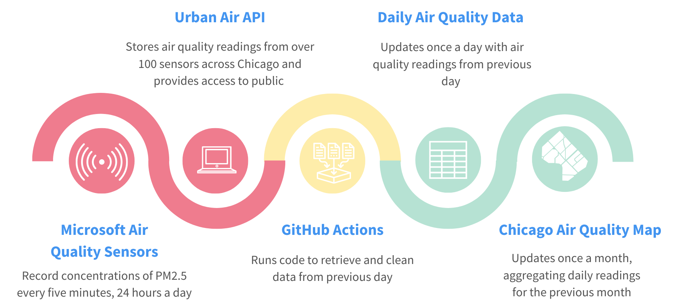

# How You Can Monitor Chicago's Air Pollution Hotspots 

**This repository contains tools to help Chicagoans stay up to date on the city's air quality** and is part of an ongoing project by MuckRock to help journalists and all Chicago residents monitor Chicago's air pollution. 

We want to help you stay on top of air pollution in your neighborhood. We built these tools to get you new data every day, so take a look around and [don't hesistate to reach out](#feedback-or-questions).


## What will you find in this repository?
  
| Fun stuff    | Nerdy stuff | 
|   :---:     |    :----:   |  
| [How it works](#how-it-works)     | [Repository structure](#repository-structure)      | 
| [How to publish our ready-made maps ](#how-to-publish-our-maps-or-charts)  | [Data dictionary](#data-dictionary)       | 
| [How you can use the data](#how-you-can-use-the-data) | [Give us some credit](#give-us-some-credit) |
  
## How it works 



### Getting the data
In the spring and summer of 2021, Microsoft Research’s Urban Innovation team started [a project in collaboration with the City of Chicago and several community groups](
https://elpc.org/blog/mapping-with-microsoft-research-tracking-air-pollution-in-chicago/) to map the city's air quality. Over 100 sensors were placed across the city, mostly on Chicago Transit Authority bus shelters, providing a more detailed picture of a city's air pollution than almost any other study in the country has achieved. 

In May 2022, MuckRock, WBEZ, and the Chicago Sun-Times published [several articles about air pollution, mapping which neighborhoods in Chicago experience the worst air quality.](https://www.wbez.org/stories/a-new-sensor-network-reveals-chicagos-air-quality-disparities/22398e94-982c-4dcc-8c13-ff0113ff95b6) We want to continue reporting. 

While Chicagoland has several EPA regulatory stations, considered the gold standard of air quality testing, they are few and far between. The sensors feeding data into this repository bring air quality from a city level down to a neighborhood level. 

### Staying up-to-date  
Every five minutes, 24 hours a day, the air quality sensors record a reading. We've written a script so that at the end of each day, the new data are pulled automatically from Urban Air's API using GitHub Actions. On the way, our code cleans the data to get rid of sensors that may not be functioning correctly and aggregates the minute-by-minute readings up to daily averages. If you'd like to analyze hourly or minute-by-minute readings, you can edit the `get_data.py` script in the folder titled `etl` (extract-transform-load). 

### Mapping air quality
To estimate how the reading of an individual sensor might explain pollution across surrounding neighborhoods, we use a formula called Inverse Distance Weighting, or IDW. This is a popular interpolation technique, which makes use of the readings from all sensors at a given time and uses those readings, based on the sensor’s distance, to estimate the level of PM2.5 pollution in regions between sensors. Our IDW is set to a spatial resolution of 300 by 300 meters, which, in some cases, may oversimplify how air pollution varies in even smaller areas. But it provides a strong estimate of how individual sensors explain neighborhood-level pollution. 

##  How you can use the data
#### Get the data 
- `etl`
  - `get_and_clean_data.py` runs a Python script that goes to Microsoft's Urban Air API and retreives data each day
    - If you want to change the frequency data is collected or get the data yourself, this where to start 
    - This script also cleans the data of sensors that may not be functioning correctly. See our longer [methodology write-up for an explanation of how and why we do that](https://www.muckrock.com/news/archives/2022/may/16/how-we-analyzed-chicago-air-pollution-hotspots/) 
#### Analyze the data
- `data`
  - `data/readings/daily_updates`
    - Contains a `csv` for each week as data is updated with the daily averages for each sensor
    - This is the best place to start digging in, and we outline some [questions you can tackle with this data in more detail on our site](link-release-post-TK)
  - `data/readings/archive`
    - Contains a `csv` file for each month; daily updates for each month are moved here when a new month starts 
#### Map the data 
- `etl`
  - `interpolation.r`
    - The code for performing IDW calculations, heavily influenced by [Dr. Marynia Kolak's tutorial on geospatial mapping](https://geodacenter.github.io/aot-workshop/)
- `mapping_data`
  - `chicago_boundaries_shapefile`
    - necessary for creating the bounding box and grid for interpolation 
  - `chicago_community_areas_shapefile`
    - generally helpful to have on hand for mapping, but not needed for the interpolation 

### Repository structure

```
.
├── README.md
├── .Rprofile
├── .gitignore
├── .github
     └── workflows 
          ├── daily_data_pull.py
├── etl
    ├── get_and_clean_data.py
    ├── map_monthly_interpolation.R

├── data
    └── readings
        └── daily_updates
            ├── week_start_date.csv
        └── archive
            ├── month-year.csv    
    └── mapping_data
        └── chicago_boundaries_shapefile 
        └── chicago_community_areas_shapefile 
├── viz
    └── static
        └── maps
            ├── interpolation_map.svg
        └── workflow
├── publish
    ├── static
        ├── pub_ready_map.png
    └── gif
        ├── interpolation_maps.gif
    └── datawrapper
        ├── link_and_embed.txt
```

### Data dictionary
| column | description  
|   :---    |    :---- |  
| device_friendly_name | name given to the sensor when Microsoft sited it, usually the name of the bus stop the sensor is attached to |
|  date | the date that 5-minute readings are aggregated up to for a daily average |
| number_of_readings | the number of readings a sensor made during that day; sensors with under 70% of hourly or daily readings are removed from the data ([see our longer methodology write-up for more on information on data cleaning](https://www.muckrock.com/news/archives/2022/may/16/how-we-analyzed-chicago-air-pollution-hotspots/)) |
| latitude | the median latitude recorded by the sensor for that day (sometimes the GPS varies slightly) |
| longitude | the median longitude recorded by the sensor for that day (sometimes the GPS varies slightly) |
| pm_25 | the daily average PM2.5 recorded by the sensor |

### How to publish our maps or charts 
  - `publish`
        - We've produced maps of air quality across the city of Chicago and overlaid the city's community areas, these are available in the `gif` and `static` folders
        - In the future, we plan to produce these maps on a monthly basis, though seasonal variation may prove it difficult to analyze a single month 
        - If you'd like to publish these maps, take a look below at [language for crediting us](#crediting-us) 
 
  
  ### Give us some credit 
  #### Reach out 
  We work to have our reporting and analysis available to a wide audience, often through distribution partnerships and syndication. If you are interested in republishing or adapting our work and it does not explicitly note that it is allowable for republishing, or if you would like clarifications about restrictions or to learn more about the underlying information, please email us at news@muckrock.com.
#### Cite us 
We ask that all republication and citation of our materials include a note that the reporting was originally published by MuckRock and include a link back to the original version. When republishing, this credit should be included at the top of the piece.

Sample language: This story was originally published by MuckRock, a nonprofit journalism organization.
#### Republish our stories 
We publish certain stories, data and other assets under a Creative Commons license and most code and data analysis scripts under an open source license. You are welcome and encouraged to reuse these under the terms of the given license, but please ensure that you understand any restrictions. For example, certain Creative Commons licenses allow reuse but only if you do not edit the underlying material.

Sample language: This story was originally published by MuckRock, a nonprofit journalism organization. It is republished under a Creative Commons (BY-ND 4.0) license.
  
  Our full editorial ethics and standards policy, which includes our standards on data and sources of information, [can be found here](https://www.muckrock.com/news/editorial-policy/).
  
Speaking of credit, **Smarth Gupta**, a former Brown Institute fellow, played an important role in laying the foundation of code and analysis for the ongoing work you see here.

#### Feedback or questions
Contact MuckRock Data Reporter Dillon Bergin at dillon@muckrock.com.
